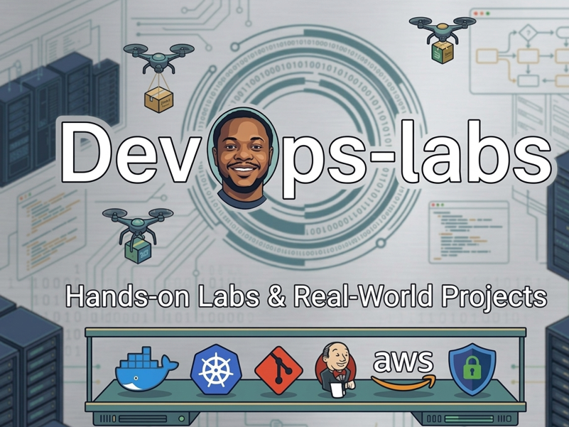

# devops-labs
Hands-on labs and real-world projects for Docker, Kubernetes, GitOps, CI/CD, AWS, DevSecOps and cloud engineering. Build muscle, not just theory.

----
<div align="center">



<h1>⚙️ DevOps Labs</h1>

<p>
  <strong>Production-grade, hands-on labs for DevOps, DevSecOps and Cloud Engineers.</strong><br/>
  No slides. No passive reading. You build, break, fix and ship — like you would on the job.
</p>


</div>

---

## 🧭 What This Is

**DevOps Labs** is a structured, progressive workshop repo built for engineers who want to move from *knowing* DevOps tools to *actually using them under realistic conditions*.

Every lab is modelled on real-world scenarios — the kind you encounter in production environments, technical interviews and cloud certifications. Each one has a clear objective, a defined outcome and a measurable result.

> Built by a practitioner, for practitioners. Start with Git. Graduate to the full production stack.

---

## 👥 Who This Is For

| Role | How you'll use this |
|------|-------------------|
| **DevOps Engineers** | Build and sharpen core container, CI/CD and IaC skills |
| **DevSecOps Practitioners** | Integrate security scanning, policies and secrets management into pipelines |
| **Cloud Engineers** | Deploy and manage workloads across AWS, GCP or Azure |
| **Platform Engineers** | Build internal tooling, GitOps workflows and developer platforms |
| **SREs** | Practice observability, incident response and reliability patterns |
| **Software Engineers** | Learn the operational side — containers, pipelines, cloud deployments |

---

## 🗺️ Learning Roadmap
```
Git & GitHub → Linux → Docker → Kubernetes → CI/CD → Terraform → AWS/Cloud → DevSecOps → Observability
     │              │        │           │          │           │            │              │
  Foundation    Foundation  Core      Orchestration Automation  IaC       Cloud Native  Security
```

Start at the beginning or jump into the track that matches your current level.

---

## 🗂️ Lab Tracks

---

### 🌿 Track 1 — Git & GitHub *(coming soon)*

> **Goal:** Master version control and collaborative workflows the way engineering teams actually use them — branching strategies, PR workflows, hooks and automation.

| # | Lab | What You'll Build | Difficulty | Est. Time |
|---|-----|-------------------|-----------|-----------|
| 01 | [Git Fundamentals & Mental Model](./git/lab-01/) | Local repo, staging, commits, history | 🟢 Foundation | 30 min |
| 02 | [Branching Strategies](./git/lab-02/) | GitFlow, trunk-based, feature branches | 🟢 Foundation | 45 min |
| 03 | [Merge vs Rebase vs Squash](./git/lab-03/) | Clean history, conflict resolution | 🟡 Intermediate | 45 min |
| 04 | [Pull Request Workflows](./git/lab-04/) | PR templates, reviews, branch protection | 🟡 Intermediate | 60 min |
| 05 | [Git Hooks & Automation](./git/lab-05/) | Pre-commit hooks, linting, secret scanning | 🟡 Intermediate | 45 min |
| 06 | [GitHub Actions — First Pipeline](./git/lab-06/) | Trigger CI on push, run tests, notify | 🔴 Advanced | 60 min |
| 07 | [Monorepo Management](./git/lab-07/) | Path filtering, affected-only pipelines | 🔴 Advanced | 75 min |

---

### 🐧 Track 2 — Linux & Shell *(coming soon)*

> **Goal:** Operate confidently in Linux environments — the foundation every DevOps and cloud role assumes you have.

| # | Lab | What You'll Build | Difficulty | Est. Time |
|---|-----|-------------------|-----------|-----------|
| 01 | [Linux CLI Survival Kit](./linux/lab-01/) | Navigate, manage files, permissions | 🟢 Foundation | 45 min |
| 02 | [Users, Groups & Permissions](./linux/lab-02/) | sudoers, chmod, chown, ACLs | 🟢 Foundation | 45 min |
| 03 | [Shell Scripting for DevOps](./linux/lab-03/) | Automate backups, deploys, health checks | 🟡 Intermediate | 60 min |
| 04 | [Process & Service Management](./linux/lab-04/) | systemd, journalctl, ps, kill | 🟡 Intermediate | 45 min |
| 05 | [Networking Fundamentals](./linux/lab-05/) | curl, netstat, ss, iptables, DNS | 🟡 Intermediate | 60 min |
| 06 | [Linux Hardening Basics](./linux/lab-06/) | SSH keys, fail2ban, auditd, ufw | 🔴 Advanced | 75 min |

---

### 🐳 Track 3 — Docker & Containers

> **Goal:** Master containers from first principles to production-hardened, security-scanned deployments.

| # | Lab | What You'll Build | Difficulty | Est. Time |
|---|-----|-------------------|-----------|-----------|
| 01 | [Running Your First Container](./Docker%20%26%20Containers/Running%20Your%20First%20Container) | Run, inspect and manage containers | 🟢 Foundation | 30 min |
| 02 | [Writing Production Dockerfiles](./docker/lab-02/) | Multi-stage builds, layer optimisation | 🟡 Intermediate | 45 min |
| 03 | [Multi-Service App with Compose](./docker/lab-03/) | 3-tier app: app + db + reverse proxy | 🟡 Intermediate | 60 min |
| 04 | [Docker Networking Deep Dive](./docker/lab-04/) | Bridge, host and overlay networks | 🟡 Intermediate | 45 min |
| 05 | [Volumes & Persistent Storage](./docker/lab-05/) | Bind mounts, named volumes, backups | 🟡 Intermediate | 45 min |
| 06 | [Container Security Scanning](./docker/lab-06/) | Scan images with Trivy, fix CVEs | 🔴 Advanced | 60 min |
| 07 | [Rootless Containers & Hardening](./docker/lab-07/) | Least privilege, read-only FS, seccomp | 🔴 Advanced | 75 min |
| 08 | [Private Registry & Image Signing](./docker/lab-08/) | Harbor registry, Cosign, SBOM | 🔴 Advanced | 90 min |

---

### ☸️ Track 4 — Kubernetes *(coming soon)*

> **Goal:** Deploy, manage, scale and secure containerised workloads on Kubernetes — from local clusters to production-grade configurations.

| # | Lab | What You'll Build | Difficulty | Est. Time |
|---|-----|-------------------|-----------|-----------|
| 01 | [Kubernetes Architecture & Core Objects](./kubernetes/lab-01/) | Pods, Deployments, Services, Namespaces | 🟢 Foundation | 60 min |
| 02 | [ConfigMaps, Secrets & Environment Config](./kubernetes/lab-02/) | Externalise config, manage secrets safely | 🟡 Intermediate | 45 min |
| 03 | [Persistent Volumes & StatefulSets](./kubernetes/lab-03/) | Deploy a stateful database workload | 🟡 Intermediate | 60 min |
| 04 | [Ingress Controllers & TLS Termination](./kubernetes/lab-04/) | NGINX Ingress, cert-manager, HTTPS | 🟡 Intermediate | 75 min |
| 05 | [Resource Limits, HPA & Autoscaling](./kubernetes/lab-05/) | CPU/memory limits, horizontal pod autoscaler | 🟡 Intermediate | 60 min |
| 06 | [RBAC & Service Account Hardening](./kubernetes/lab-06/) | Roles, RoleBindings, least privilege | 🔴 Advanced | 75 min |
| 07 | [Network Policies](./kubernetes/lab-07/) | Zero-trust networking between pods | 🔴 Advanced | 60 min |
| 08 | [Helm — Package & Deploy Applications](./kubernetes/lab-08/) | Write, template and release a Helm chart | 🔴 Advanced | 90 min |
| 09 | [GitOps with ArgoCD](./kubernetes/lab-09/) | Declarative deployments, sync, rollback | 🔴 Advanced | 90 min |
| 10 | [Cluster Hardening & CIS Benchmarks](./kubernetes/lab-10/) | kube-bench, Pod Security Standards, audit logs | 🔵 Expert | 120 min |

---

### 🔄 Track 5 — CI/CD Pipelines  *(coming soon)*

> **Goal:** Build automated, secure, end-to-end pipelines from commit to production deployment.

| # | Lab | What You'll Build | Difficulty | Est. Time |
|---|-----|-------------------|-----------|-----------|
| 01 | [GitHub Actions — CI Pipeline](./cicd/lab-01/) | Build, test and lint on every push | 🟢 Foundation | 45 min |
| 02 | [Dockerise & Push in a Pipeline](./cicd/lab-02/) | Build image, tag, push to registry | 🟡 Intermediate | 60 min |
| 03 | [Secrets Management in Pipelines](./cicd/lab-03/) | GitHub Secrets, OIDC, least privilege | 🟡 Intermediate | 60 min |
| 04 | [Matrix Builds & Parallelism](./cicd/lab-04/) | Multi-OS, multi-version parallel jobs | 🟡 Intermediate | 45 min |
| 05 | [Security Scanning in CI](./cicd/lab-05/) | Trivy, Snyk, SAST — fail on critical CVEs | 🔴 Advanced | 75 min |
| 06 | [CD to Kubernetes via ArgoCD](./cicd/lab-06/) | GitOps CD pipeline, image update automation | 🔴 Advanced | 90 min |
| 07 | [Pipeline as Code with Jenkins](./cicd/lab-07/) | Declarative Jenkinsfile, shared libraries | 🔴 Advanced | 90 min |
| 08 | [GitLab CI End-to-End Pipeline](./cicd/lab-08/) | Full GitLab CI/CD with environments | 🔴 Advanced | 90 min |

---

### 🏗️ Track 6 — Infrastructure as Code (Terraform) -- *(coming soon)*

> **Goal:** Provision, manage and version cloud infrastructure declaratively — and safely destroy it when you're done.

| # | Lab | What You'll Build | Difficulty | Est. Time |
|---|-----|-------------------|-----------|-----------|
| 01 | [Terraform Fundamentals](./terraform/lab-01/) | Providers, resources, state, plan, apply | 🟢 Foundation | 60 min |
| 02 | [Variables, Outputs & Locals](./terraform/lab-02/) | Reusable, parameterised configs | 🟢 Foundation | 45 min |
| 03 | [Remote State & Locking](./terraform/lab-03/) | S3 backend, DynamoDB locking | 🟡 Intermediate | 60 min |
| 04 | [Modules — Write Your Own](./terraform/lab-04/) | Reusable VPC, compute and security modules | 🟡 Intermediate | 90 min |
| 05 | [Provision an AWS EKS Cluster](./terraform/lab-05/) | Full EKS cluster with node groups via Terraform | 🔴 Advanced | 120 min |
| 06 | [Terraform Security & Compliance](./terraform/lab-06/) | tfsec, Checkov, policy-as-code with Sentinel | 🔴 Advanced | 90 min |
| 07 | [Terragrunt — DRY Terraform at Scale](./terraform/lab-07/) | Multi-env, multi-account structure | 🔵 Expert | 120 min |

---

### ☁️ Track 7 — AWS & Cloud Engineering *(coming soon)*

> **Goal:** Deploy and operate real workloads on AWS — compute, networking, storage, security and cost management.

| # | Lab | What You'll Build | Difficulty | Est. Time |
|---|-----|-------------------|-----------|-----------|
| 01 | [AWS Core Services Orientation](./aws/lab-01/) | EC2, S3, IAM, VPC — hands-on tour | 🟢 Foundation | 60 min |
| 02 | [VPC from Scratch](./aws/lab-02/) | Custom VPC, subnets, IGW, route tables, NAT | 🟡 Intermediate | 90 min |
| 03 | [IAM — Least Privilege in Practice](./aws/lab-03/) | Roles, policies, SCPs, permission boundaries | 🟡 Intermediate | 75 min |
| 04 | [Deploy a Containerised App on ECS Fargate](./aws/lab-04/) | Task definitions, services, ALB, ECR | 🟡 Intermediate | 90 min |
| 05 | [Serverless with Lambda & API Gateway](./aws/lab-05/) | Event-driven API, S3 trigger, DLQ | 🟡 Intermediate | 90 min |
| 06 | [EKS — Managed Kubernetes on AWS](./aws/lab-06/) | Deploy cluster, IRSA, ALB Ingress, EBS CSI | 🔴 Advanced | 120 min |
| 07 | [AWS Security Hardening](./aws/lab-07/) | GuardDuty, Security Hub, Config, CloudTrail | 🔴 Advanced | 90 min |
| 08 | [Multi-Account Architecture](./aws/lab-08/) | AWS Organizations, Control Tower, SCPs | 🔵 Expert | 120 min |
| 09 | [Cost Optimisation Engineering](./aws/lab-09/) | Cost Explorer, Budgets, rightsizing, Savings Plans | 🔴 Advanced | 75 min |

---

### 🛡️ Track 8 — DevSecOps & Security Engineering  *(coming soon)*

> **Goal:** Shift security left — embed it into code, containers, pipelines and infrastructure from day one.

| # | Lab | What You'll Build | Difficulty | Est. Time |
|---|-----|-------------------|-----------|-----------|
| 01 | [Threat Modelling for DevOps Pipelines](./devsecops/lab-01/) | STRIDE model applied to a real pipeline | 🟡 Intermediate | 60 min |
| 02 | [SAST — Static Code Analysis in CI](./devsecops/lab-02/) | Semgrep, Bandit, fail pipeline on findings | 🟡 Intermediate | 60 min |
| 03 | [SCA — Dependency & Licence Scanning](./devsecops/lab-03/) | Snyk, OWASP Dependency-Check, SBOM | 🟡 Intermediate | 60 min |
| 04 | [Secrets Detection & Prevention](./devsecops/lab-04/) | Gitleaks, truffleHog, pre-commit hooks | 🟡 Intermediate | 45 min |
| 05 | [Container Image Hardening](./devsecops/lab-05/) | Distroless, Trivy, Dockle, CIS benchmarks | 🔴 Advanced | 90 min |
| 06 | [Policy as Code with OPA & Gatekeeper](./devsecops/lab-06/) | Enforce Kubernetes admission policies | 🔴 Advanced | 90 min |
| 07 | [Runtime Security with Falco](./devsecops/lab-07/) | Detect anomalous container behaviour live | 🔴 Advanced | 90 min |
| 08 | [Secrets Management with HashiCorp Vault](./devsecops/lab-08/) | Dynamic secrets, PKI, Kubernetes auth | 🔴 Advanced | 120 min |
| 09 | [Supply Chain Security & SLSA](./devsecops/lab-09/) | Cosign, SBOM, provenance, SLSA Level 2 | 🔵 Expert | 120 min |
| 10 | [Zero Trust Architecture on Kubernetes](./devsecops/lab-10/) | mTLS with Istio, SPIFFE/SPIRE, network policies | 🔵 Expert | 150 min |

---

### 📊 Track 9 — Observability & Monitoring  *(coming soon)*

> **Goal:** Build visibility into systems before things break — and diagnose fast when they do.

| # | Lab | What You'll Build | Difficulty | Est. Time |
|---|-----|-------------------|-----------|-----------|
| 01 | [Prometheus & Grafana Stack](./observability/lab-01/) | Scrape metrics, build dashboards | 🟢 Foundation | 60 min |
| 02 | [Application Instrumentation](./observability/lab-02/) | Custom metrics with Prometheus client libs | 🟡 Intermediate | 60 min |
| 03 | [Centralised Logging — ELK Stack](./observability/lab-03/) | Ship, parse and query logs with Elasticsearch | 🟡 Intermediate | 90 min |
| 04 | [Distributed Tracing with Jaeger](./observability/lab-04/) | Trace requests across microservices | 🔴 Advanced | 90 min |
| 05 | [Alerting & On-Call Runbooks](./observability/lab-05/) | AlertManager, PagerDuty, runbook templates | 🔴 Advanced | 75 min |
| 06 | [SLOs, SLIs & Error Budgets](./observability/lab-06/) | Define, measure and report reliability | 🔴 Advanced | 90 min |

---

### ⚙️ Track 10 — Configuration Management *(coming soon)*

> **Goal:** Manage infrastructure configuration at scale — consistently, repeatably and auditably.

| # | Lab | What You'll Build | Difficulty | Est. Time |
|---|-----|-------------------|-----------|-----------|
| 01 | [Ansible Fundamentals](./ansible/lab-01/) | Inventory, playbooks, ad-hoc commands | 🟢 Foundation | 60 min |
| 02 | [Roles & Reusable Playbooks](./ansible/lab-02/) | Modular, idempotent configuration | 🟡 Intermediate | 75 min |
| 03 | [Ansible Vault — Secrets at Rest](./ansible/lab-03/) | Encrypt secrets in playbooks and vars | 🟡 Intermediate | 45 min |
| 04 | [Configure a K8s Cluster with Ansible](./ansible/lab-04/) | Provision and configure nodes end-to-end | 🔴 Advanced | 120 min |

---

## 🛠️ Tools & Technologies Covered

<div align="center">

| Category | Tools |
|----------|-------|
| **Version Control** | Git, GitHub, GitLab, pre-commit, Gitleaks |
| **Containers** | Docker, Docker Compose, Podman, Harbor, Cosign |
| **Orchestration** | Kubernetes, Helm, ArgoCD, Kustomize, k3s |
| **CI/CD** | GitHub Actions, GitLab CI, Jenkins, Tekton |
| **Infrastructure as Code** | Terraform, Terragrunt, Pulumi, Ansible |
| **Cloud** | AWS (EKS, ECS, Lambda, VPC, IAM, S3, RDS) |
| **Security** | Trivy, Falco, OPA, Vault, Semgrep, Snyk, Gatekeeper |
| **Observability** | Prometheus, Grafana, ELK Stack, Jaeger, AlertManager |
| **Networking** | NGINX, Istio, Envoy, cert-manager, ExternalDNS |
| **Operating Systems** | Ubuntu, Amazon Linux 2, Alpine |

</div>

---

## 📁 Repository Structure
```
devops-labs/
├── git/
│   ├── lab-01-fundamentals/
│   ├── lab-02-branching/
│   └── ...
├── linux/
│   ├── lab-01-cli/
│   └── ...
├── docker/
│   ├── lab-01-first-container/
│   ├── lab-02-dockerfiles/
│   └── ...
├── kubernetes/
│   ├── lab-01-core-objects/
│   └── ...
├── cicd/
│   ├── lab-01-github-actions/
│   └── ...
├── terraform/
│   ├── lab-01-fundamentals/
│   └── ...
├── aws/
│   ├── lab-01-core-services/
│   └── ...
├── devsecops/
│   ├── lab-01-threat-modelling/
│   └── ...
├── observability/
│   ├── lab-01-prometheus-grafana/
│   └── ...
├── ansible/
│   ├── lab-01-fundamentals/
│   └── ...
└── assets/
    └── banner.png
```

Each lab folder follows this structure:
```
lab-01-first-container/
├── README.md          ← objectives, background, tasks
├── solution/          ← reference solution (attempt first)
├── Dockerfile         ← starter file where applicable
└── docker-compose.yml ← where applicable
```

---

## 🚀 Getting Started
```bash
# 1. Clone the repo
git clone https://github.com/YOUR_USERNAME/devops-labs.git

# 2. Navigate into a track
cd devops-labs/docker/lab-01-first-container

# 3. Read the lab brief
cat README.md
```

### Difficulty guide

| Badge | Level | Assumes |
|-------|-------|---------|
| 🟢 Foundation | No prior experience with this tool | Basic Linux CLI |
| 🟡 Intermediate | Comfortable with the basics | Tool fundamentals done |
| 🔴 Advanced | Production-level challenge | Intermediate labs done |
| 🔵 Expert | Mirrors real engineering interviews and incidents | Full track completed |

---

## 🛠️ Prerequisites by Track

| Track | Minimum Requirements |
|-------|---------------------|
| Git & GitHub | A GitHub account, terminal access |
| Linux | A Linux/macOS terminal or WSL2 on Windows |
| Docker | Docker Desktop or Docker Engine installed |
| Kubernetes | Docker done, kubectl installed, k3s or minikube |
| CI/CD | GitHub account, Docker Hub or ECR account |
| Terraform | AWS account (free tier), Terraform CLI installed |
| AWS | AWS account, AWS CLI configured |
| DevSecOps | Kubernetes track recommended first |
| Observability | Docker or Kubernetes track done |
| Ansible | Linux track done, SSH access to at least one target |

---

## 🤝 Contributing

Contributions are welcome — new labs, corrections, improved solutions and translations.

1. Fork this repository
2. Create a branch: `git checkout -b lab/track-name-lab-title`
3. Follow the [lab template](./CONTRIBUTING.md)
4. Open a Pull Request with a clear description of what the lab teaches

Please read [CONTRIBUTING.md](./CONTRIBUTING.md) before submitting.

---

## 📄 License

MIT — free to use, share and build on. Attribution appreciated.

---

<div align="center">

**If this repo helped you — star it ⭐**<br/>
<sub>It takes 2 seconds and helps other engineers find it.</sub>

<br/>


</div>
